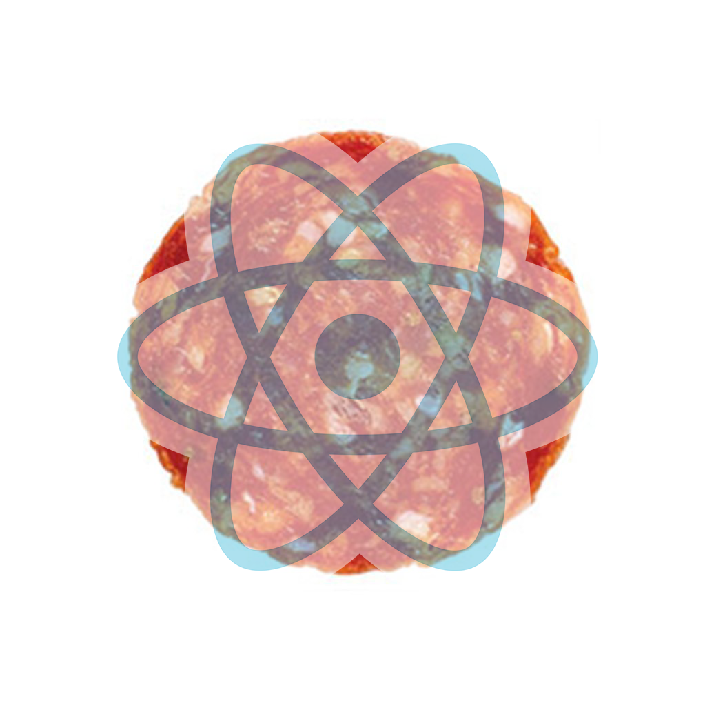

# Reactaroni

An app I build in React to see how many pepperoni's I was ingesting daily. You need two things to run this ```npm``` and ```yarn```. So if you're on Mac OSX and don't have either run 

```brew install npm```

Then

```brew install yarn```

Then run 

```yarn start```

Now track your pepperoni intake by an app Montana Mendy created in React! This is, Reactaroni! 
